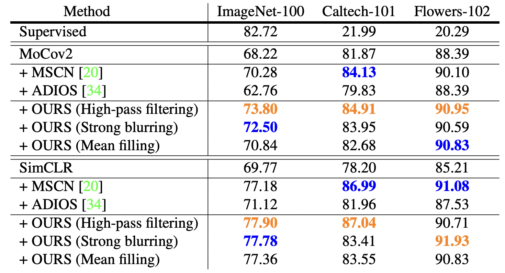
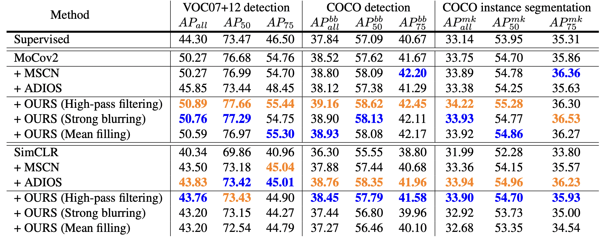

# Masking Improves Contrastive Self-Supervised Learning for ConvNets and Saliency Tells You Where

[](https://opensource.org/licenses/MIT)
[](https://arxiv.org/abs/2309.12757)

Code for the paper "Masking Improves Contrastive Self-Supervised Learning for ConvNets and Saliency Tells You Where"

Paper: https://arxiv.org/abs/2309.12757 \
Authors: [Zhi-Yi Chin](https://joycenerd.github.io/) $^{\dagger*}$, Chieh-Ming Jiang $^{\dagger*}$, [Ching-Chun Huang](http://acm.cs.nctu.edu.tw/) $^\dagger$, [Pin-Yu Chen](https://sites.google.com/site/pinyuchenpage) $^\ddagger$, [Wei-Chen Chiu](https://walonchiu.github.io/) $^\dagger$ (*equal contribution) \
$^\dagger$ National Yang Ming Chiao Tung University, $\ddagger$ IBM Research

To be published in [WACV 2024](https://wacv2024.thecvf.com/)

## Overview

Our paper addresses the challenge of incorporating masking operations into contrastive-learning for ConvNets to improve self-supervised learning. We've observed that random masking in self-supervised learning can disproportionately emphasize salient objects in one view, leading to misrepresentative contrastive relationships; therefore, we introduce an approach that rectifies this bias by promoting a balanced distribution of masked regions while considering saliency. We also introduce hard negative samples by masking larger regions of salient patches. Our experiments demonstrate superior performance compared to existing methods across various datasets and downstream tasks.

## Setup
```bash
conda env create --file environment.yml -n mask
conda activate mask
```

## Data Preparation

### Download ImageNet
Download link: https://image-net.org/challenges/LSVRC/2012/2012-downloads.php
1. Signup and login
2. `wget {data link address}`
3. `tar -xvf {XXX.tar} -C {XXX}`
4. Decompress tar files: `python decompresses_tar_dir.py -d {XXX}`
5. Make validation images have the same folder structure as training images: `python val_split.py --root [IMAGENET_ROOT] --val-img-dir {ORIGINAL_VAL_DIR} --val-annot-dir {VAL_ANNOT_DIR} --train-img-dir {TRAIN_IMG_DIR} --save-dir {PROCESSED_VAL_DIR}`

### Make ImageNet-100
Modify imagenet path data path and imagenet100 saving path inside `imagenet100.sh`

```bash
bash imagenet100.sh
```

## Experiments

### SSL pre-train the encoder

```bash
CUDA_VISIBLE_DEVICES=0,1,2,3 python main_moco.py \
    -a resnet50 
    --lr 0.015 --batch-size 128 --epochs 200 \
    --dist-url 'tcp://localhost:10001' --multiprocessing-distributed --world-size 1 \
    --rank 0 --mlp --moco-t 0.2 --aug-plus --cos \
    --save-dir {RES_AND_LOG_SAVE_PATH} \
    --alpha 2.0 --num-nonsem 1 \
    --strategy hp \
    {DATA_PATH}
```

- If you are using a 4 GPU machine set `--lr 0.015 --batch-size 128`, 8 GPU machine set `--lr 0.03 --batch-size 256`
- `--alpha`: hard negative weight
- `--num-nonsem`: how many hard negative views per qk pair
- `--strategy`: choose 1 masking stratgey setting from: hp, blur, and mean

### Fine-tune linear classifier

```bash
CUDA_VISIBLE_DEVICES=0,1,2,3 python main_lincls.py \
  -a resnet50 \
  --lr 30.0 \
  --batch-size 256 \
  --pretrained {ENCODER_CKPT} \
  --dist-url 'tcp://localhost:10001' --multiprocessing-distributed --world-size 1 --rank 0 \
  --save-dir {RES_SAVE_PATH} \
  --n-classes 100 \
  --strategy hp \
  {DATA_PATH}
```

## Paper Results

### Classification (Linear Evaluation)


### Detection and Segmentation


## Reference Repositories
- MoCo: https://github.com/facebookresearch/moco
- Contrastive Learning with Non-Semantic Negatives: https://github.com/SongweiGe/Contrastive-Learning-with-Non-Semantic-Negatives

## Citation
[](https://doi.org/10.48550/arXiv.2309.12757)

Please cite our paper if it's helpful to your work!
```
@inproceedings{chin2023masking,
  title={Masking Improves Contrastive Self-Supervised Learning for ConvNets, and Saliency Tells You Where},
  author={Zhi-Yi Chin and Chieh-Ming Jiang and Ching-Chun Huang and Pin-Yu Chen and Wei-Chen Chiu},
  booktitle={Proceedings of the IEEE/CVF Winter Conference on Applications of Computer Vision (WACV)}
  year={2024},
}
```